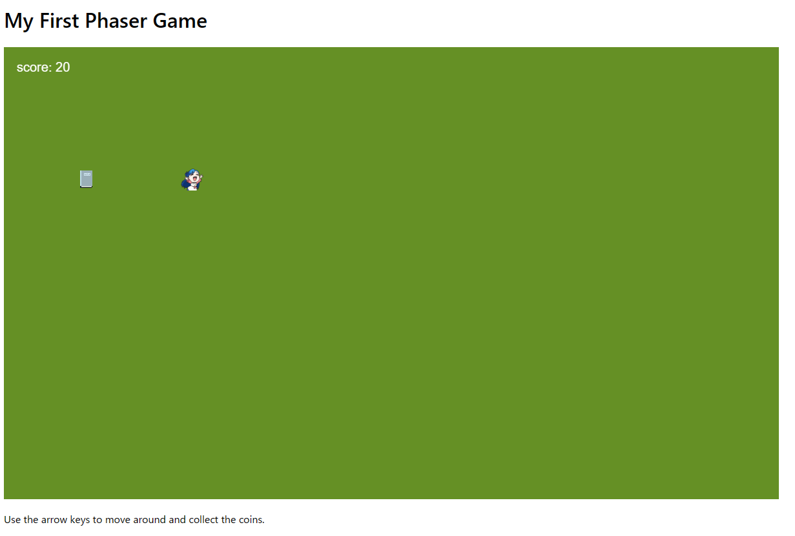

# Javascript-Phaser-Game
## Overview
Welcome to my 60-Day Personal Project Challenge! In this challenge, I will be creating a series of random projects that I will try to relate to Ascendance of a Bookworm, a series that is near and dear to my heart, written by Miya Kazuki.
## Project Description
For the first project in this challenge, I have created a simple game scene using the Phaser game framework. The game scene, called `mainScene`, features a player sprite (myne) and a book sprite. The objective of the game is to control the myne sprite using arrow keys and collect the book sprite. Each time the myne and book overlap, the score increases, and a tween effect is applied to the myne sprite.

## Installation
To run the project locally, please follow these steps:

1. Clone the project repository.
2. Type python -m http.server 8888 (or python -m SimpleHTTPServer 8888 if you are using Python 2).
3. Open the project in a web browser.
4. The game scene will be displayed, and you can start playing by controlling the myne sprite with the arrow keys.

## Technologies Used
- JavaScript
- Phaser game framework

## Project Structure
- `index.html`: The HTML file containing the game canvas and necessary scripts.
- `game.js`: The JavaScript file that defines the game scene and its logic.
- `assets/`: The directory containing the game assets (images).

## Project during execution

## Usage
- Use the arrow keys to control the myne sprite.
- Collect the book sprite to increase the score.
- Enjoy playing the game!

## Conclusion
This project marks the beginning of my 60-Day Personal Project Challenge, where I will be working on various projects that pique my interest. The emphasis of this challenge is to have fun, explore different areas, and learn new things along the way. Stay tuned for more exciting projects in the coming days!

If you have any feedback, suggestions, or ideas for future projects, feel free to reach out. Happy coding!
